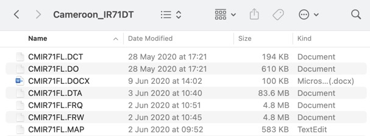
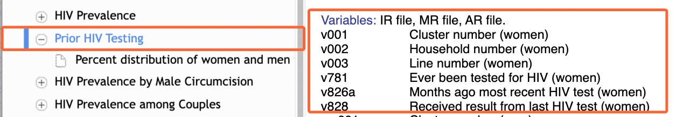

```{r echo =F, warning=F, message=F}
# Load packages 
if(!require(pacman)) install.packages("pacman")
pacman::p_load(tidyverse, vembedr)
```

# **Summary**

For the final assessment, you will use Demographic and Health Survey (DHS) data to create a short Rmarkdown-based report, focusing on a specific country and a topic of your choosing.

The report should:

-   Be based on one of the DHS women's recode survey datasets we have compiled for you [here](https://drive.google.com/drive/u/0/folders/1J0gw4qpfbB8bYFbXx8QcsQEWgJSVwp_P){target="_blank"};

-   Be at least 300 words in length; and

-   Include at least four ggplot2-based figures

To submit, you should

-   upload a zip folder with two files---your Rmarkdown and your knitted HTML/PDF/DOCX file---to the assignment page; and

-   record a short video (5 to 15 minutes long) in which you talk through your Rmd document and its output. (This is not graded, it is just a way to verify that you are the actual author of your work.). Put a link to this video in the comments section of the assignment page. If you are not sure how to record and share a video, see the FAQs at the bottom of this document.

The deadline for submission is Jan 31st 2022 at 23:59 UTC+2. Late work will be penalized.

Those are the instructions in a nutshell. The rest of this document is a guide to help you excel at this task.

## Example report

To help give you a clear sense of what is expected of you, we have created an example submission, a report which would earn a high grade on this task. You can access that report by downloading the zip folder [here](https://minhaskamal.github.io/DownGit/#/home?url=https://github.com/the-graph-courses/rbp_cohort_0_materials/tree/main/final_assignment_example){target="_blank"}.

Before working on your own assignment, you may choose to try to replicate this report. In this case you will need to download its source data, which is the Nigerian 2018 DHS survey. You can find and download this dataset [here](https://drive.google.com/drive/u/0/folders/1J0gw4qpfbB8bYFbXx8QcsQEWgJSVwp_P){target="_blank"} (the same folder that houses the other compiled datasets).

------------------------------------------------------------------------

::: side-note
**Systematic vs just-in-time learning**

As you work on this assessment, you will encounter many functions and concepts you have not previously learned. You'll therefore be required to pick these up "on the go" as you move through the analysis. This type of just-in-time learning, where you acquire knowledge exactly at the point when you need it, is quite different from the systematic, front-loaded learning approach that we have used throughout the course thus far, where all relevant information was presented before it was applied or tested.

Just-in-time learning will require you to be proactive in seeking out resources and asking for help when needed. It may be challenging at times, but it is a valuable skill to have as a programmer and will serve you well in your future career.
:::

------------------------------------------------------------------------

Now let's see what are the recommended sequences of steps for working on the assessment.

# **Step 1: Understand the DHS**

Before beginning your analysis, it is important to understand the Demographic and Health Surveys (DHS) and the data that you will be using.

The Demographic and Health Surveys (DHS) are a series of standardized surveys conducted periodically in developing countries that collect data on various aspects of population, health, and nutrition. These surveys, which are funded by the United States Agency for International Development (USAID), are a gold-standard source of reliable public health data for many countries and international bodies.

You can learn more about the DHS program and the various surveys they run by watching the following video:

```{r echo = F}
embed_url("https://www.youtube.com/watch?v=abP6xeb50Do")
```

Pay particular attention to the section from 2:33 to 3:20, as it provides information on the specific survey type whose data you will be using.

------------------------------------------------------------------------

Several datasets (called recodes) are made available from each survey, including a household recode, men's recode and the women's recode (sometimes called the individual recode). This *individual/women's recode* dataset contain individual-level data on women aged 15 to 49 in the surveyed households. It will be the source for your reports.

To hear more about the different recodes, you can watch the following optional video:

```{r echo = F}
embed_url("https://www.youtube.com/watch?v=BmiSDPebmgc")
```

# **Step 2: Choose a report topic**

Now that you have a general understanding of the DHS surveys and the data that is collected, it's time to choose a topic for your report. This will determine the focus of your analysis and the specific statistics you will be presenting.

To help guide your selection, we recommend that you look through a few "Key Findings/Summary Reports" that DHS-participating countries have published. These reports highlight important findings and patterns from the surveys and should serve as inspiration for your own analysis. Links to a few examples can be found below:

-   [Nigeria 2018](https://drive.google.com/file/d/10pp9O9EJZvideynYyANqJtBCsN_vNQjs/view?usp=sharing){target="_blank"}

-   [Colombia 2015 (Spanish)](https://drive.google.com/file/d/1aD7AAzucXvKzqgp6-cC9w5v9bAdbOAJu/view?usp=share_link){target="_blank"}

-   [Madagascar 2021 (French)](https://drive.google.com/file/d/1UYysl3VcY9mFb_r7X__Uaue1LhnY2j0k/view?usp=sharing){target="_blank"}

-   [Jordan 2017-18](https://drive.google.com/file/d/1-7snwWkSdD4leDj6D1Wf6o93qqX4pbo-/view?usp=sharing){target="_blank"}

And you can peruse all the available reports [**here**](https://dhsprogram.com/search/index.cfm?_srchd=1&bydoctype=publication&bypubtype=10){target="_blank"}.

Each of the main headings and subheadings of these reports could be a theme for your report. Potential topics include family planning, gender, maternity, alcohol and tobacco, fertility, HIV, tuberculosis, youth, disability, women's empowerment and domestic violence.

Importantly, we recommend you choose a topic and set of statistics in which *women* are the unit of analysis, not their children, and not men. For example, the topic of anaemia covered on page 13 of the Nigeria 2018 Key Findings [report](https://drive.google.com/file/d/10pp9O9EJZvideynYyANqJtBCsN_vNQjs/view){target="_blank"} uses children as the unit of analysis (reporting, for example, that 68% of children age 6-59 months are anemic). This is not something you will be able to calculate with the women's recode file; it should therefore be avoided.

# **Step 3: Obtain the women's recode file for a specific country**

To conduct your analysis, you will need access to the individual (women's) recode files for a specific country's DHS survey. All DHS data can be obtained directly from the DHS website by [registering](https://dhsprogram.com/data/new-user-registration.cfm){target="_blank"} for an account and filing a data request. These are usually approved in a few hours.

However, to speed you up, we have already requested and compiled the data you will need: the latest women's recode datasets for any countries surveyed since 2003. **You should select a survey to analyze from this collection. To access these files, follow this Google Drive [link](https://drive.google.com/drive/folders/1J0gw4qpfbB8bYFbXx8QcsQEWgJSVwp_P?usp=share_link){target="_blank"}.** From this folder, choose the zip file for the country you are interested in, download that to your computer, then unzip the downloaded file.

Once you have downloaded and unzipped the folder, you will see that it contains several different file types:

{width="500"}

Most of these files are superfluous to your need. **The two files that you will need for this analysis are the .DTA file (the main data file in STATA format) and the .MAP file (the data dictionary).**

Create a new RStudio project for your analysis and place these two files in the "data" subfolder of your project.

::: side-note
**DHS file name conventions**

You may be a bit puzzled by the file names you see. DHS file names follow a specific convention, with the Country Code (e.g. CM for Cameroon), Dataset Type (e.g. IR for the women's dataset), Dataset Version (indicated by the first and second characters, representing the DHS Phase and Release version, respectively), and File Format (e.g. DT-Stata, SD-SAS) all included. For your convenience, we have renamed the zip files using the full country names rather than the country codes.

One part of the name you should pay attention is the number immediately after "IR" in the file names, which indicates the DHS survey phase. For example, if the file name is "Cameroon_IR71DT", the number 7 indicates that this is DHS survey phase 7. The survey phase gives you a sense of when the survey was carried out. You can see the phase timeline [here](https://dhsprogram.com/data/Guide-to-DHS-Statistics/Description_of_The_Demographic_and_Health_Surveys_Program.htm){target="_blank"}.

The rest of the file name nomenclature is not particularly important for this analysis, but you can learn more about it in this video:

```{r echo = F}
embed_url("https://www.youtube.com/watch?v=puCCqGU71uM")
```
:::

# **Step 4: Import your dataset into R**

To import the DHS dataset from the .DTA format into R, you should use the `read_dta()` function from the {haven} package.

Because DHS files can be quite large, it is recommended that you do not import the entire dataset at once, as this may take unreasonably long to run. Instead, you should use either the `n_max` or the `col_select` argument of `read_dta()` to import only a subset of the data.

The `n_max` argument allows you to specify the number of rows to import. For example:

```{r eval = F}
ir_raw <- haven::read_dta(here("data/NGIR7BFL.DTA"),
                          n_max = 300)
```

This will only import the first 300 rows.

The `col_select` argument allows you to select specific columns to import, either by name or by position. For example:

```{r eval = F}
# select by position
ir_raw <- haven::read_dta(here("data/NGIR7BFL.DTA"),
                          col_select = 1:3)

# select by name
ir_raw <- haven::read_dta(here("data/NGIR7BDT/NGIR7BFL.DTA"),
                           col_select = c(caseid, v000, v001))
```

You will probably want to start your analysis by first importing all columns but just a few rows (maybe 100 rows, with `n_max = 100`). This way you can explore all the columns in the dataset.

Then, when you have decided which are the columns of interest, you can import all rows but only those columns needed for your analysis, using `col_select`.

Another note on importing data: the `read_dta()` function reads in factor data as a special data type called **labelled** data. This type is unfamiliar to you and can be problematic for later analysis, so we recommend converting these to regular R factors using the function `haven::as_factor()`.

For example:

```{r eval = F}
ir_converted <- 
  ir_raw %>%
  haven::as_factor() # pass the whole data frame to as_factor()
```

# **Step 5: Identify and analyze the relevant variables**

You now have downloaded and imported the data you need, and you have an analysis topic in mind, your next step is to figure out which of the DHS variables is relevant for the analyses you are conducting. This is not a simple task, since the DHS variable names are not very descriptive (with variable names are v000 and v001), and there are several *thousand* available variables to sort through.

To find variables relevant to your chosen topic, you can use two key resources.

1.  The first is the .MAP file we talked about earlier, which is available in the zip file you downloaded. If you open the .MAP file for your downloaded survey (with TextEdit or Notepad) you'll see that it is a data dictionary with a definition for each variable. Here are a few lines from one such .MAP file:

    CASEID (id) Case Identification\
    V000 Country code and phase\
    V001 Cluster number\
    V002 Household number\
    V003 Respondent's line number

    As you can see, each line has the name of the variable and the variable's definition.

    So, if you are working on a topic like HIV, you can simply search the .MAP file for the word "HIV", and you will be lead to the HIV-relevant variables.

    Sometimes the variable descriptions in the .MAP files are not detailed enough. In that case, you can search for the variable name in the DHS recode manual for your survey phase, which you can find on [this page](https://dhsprogram.com/publications/publication-dhsg4-dhs-questionnaires-and-manuals.cfm){target="_blank"}. The recode manuals are similar to the MAP files, but they explain each variable in a bit more detail.

2.  Secondly, the DHS has created a wonderful online resource called "Guide to DHS statistics", viewable [here](https://dhsprogram.com/data/Guide-to-DHS-Statistics){target="_blank"}. If you are studying a topic like HIV, you can simply go to HIV section, click on a specific subtopic, e.g. "Prior HIV testing" and you will see a list of variables that are relevant to that statistic.



Using the above two methods, it should be possible to identify the key variables required to calculate the relevant statistics for your chosen topic.

# **Step 6: Read the rubric**

As you work on your analysis, you should keep in mind the rubric against which your work will be graded. Your report will be assessed along the following five dimensions:

1.  Data wrangling (30% of grade)

2.  Quality of figures (30%)

3.  Communication of insights (15%)

4.  Use of Rmarkdown (15%)

5.  Syntax and code formatting (10%)

Each component is outlined in more detail below.

## **Data wrangling**

To get full credit in this category, you will need to demonstrate that you have used appropriate data wrangling techniques to prepare the data for analysis. This includes cleaning and organizing the data, selecting relevant variables, and grouping and summarizing the data as needed. To score maximum points here, it would be wise to pick and present statistics that are not too \*easy\* to calculate. At least a few of the numbers you present should have required substantial data wrangling steps with dplyr verbs.

## **Quality of figures**

To get full credit in this category, you will need to create at least four ggplot-based figures that are clear, informative, and aesthetically pleasing. You should also make sure to include appropriate titles and labels for your figures.

## **Communication of insights**

To get full credit in this category, you will need to clearly and concisely communicate your findings and insights from the data analysis. This includes writing clear, concise, and well-organized text, as well as effectively using the figures you have created to support your insights.

## **Use of Rmarkdown**

To get full credit in this category, you will need to demonstrate that you have effectively used Rmarkdown to create a professional-looking document. This includes using appropriate formatting, including headings and lists, and using Rmarkdown features such as inline code.

## **Syntax and code formatting**

To get full credit in this category, you will need to demonstrate that you have used clean, well-organized code that is easy to read and understand. This includes using appropriate indentation, commenting your code, and using clear, descriptive variable names.

# **Step 7: Submit your work**

As mentioned above, to submit your work you should:

-   Knit your Rmd to an HTML/PDF or DOCX format.

-   Zip the Rmd and and the knitted output into a single folder, and upload to the assignment page.

-   Record a 5-15 minute walkthrough of your Rmd and knitted output, and leave a link to this as a comment on the assignment page.

# **FAQs**

**My percentages and numbers differ slightly with those seen in the official DHS publications. What is going on?**

Due to the sampling design of the DHS, respondent data is actually supposed to be weighted when conducting analyses. But we have not yet taught you how to do this, and do not expect you to take into account the respondent weights. So your numbers will differ slightly from the official numbers. This is okay! (For those of you who would like to understand how to conduct weighted analyses, we will record and share a video of this soon.)

**This sounds like a lot of work. Why should I try to do a good job at this?**

First, your score on the final assessment will compose 40% of your final grade. Doing a very poor job here may jeopardize your ability to earn a certificate for the course (the pass mark for the course is 70%).

Secondly, this is a valuable opportunity to reinforce your knowledge, and bring together many of the things you have learned over the course. This is a great way to solidify much of your learning/

Finally, depending on how much effort you put into it, the report you create could be a good addition to your data analysis portfolio, a great way to showcase your abilities to potential employers or academic institutions in the future. This will especially be the case after you have received and acted on the feedback you'll receive from our instructors.

**Must the report be in English?**

You are allowed to write the report in English, French or Spanish.

**How should I record a video?**

If you have never done a screen recording before, we recommend Loom.com. It allows you to quickly record your screen AND share that recording immediately. So there is no need to upload to Youtube, Vimeo, or some other such service. A video tutorial on using Loom is [here](https://www.youtube.com/watch?v=DUExJ0RQAiE&ab_channel=GoogleTutorials){target="_blank"}.

**What should I include in my video presentation?**

In your video presentation, you should walk through your Rmd document, explaining your code, your analyses and some of your findings. As a reminder, this video presentation is not graded. We ask for it as a way to verify that you are the author of the work submitted.

**Can I use data from a different survey than the Demographic and Health Survey (DHS)?**

Yes, but you will first need to obtain permission from one of our instructors.

**Can I use a different data visualization package other than ggplot?**

Yes; other options include plotly, highcharter. Get permission from an instructor before proceeding with this though.

**Can I create a dashboard using flexdashboard instead of a flat HTML/PDF document?**

Yes. Any Rmarkdown-based format is acceptable!
